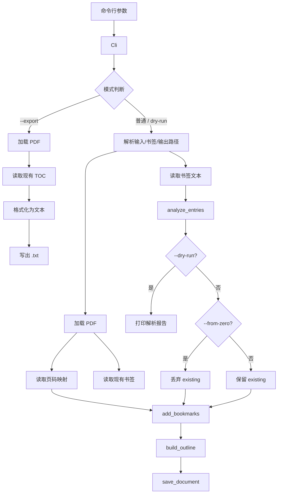

# simplebookmarker 设计说明与 Rust 小教程

## 摘要

`simplebookmarker` 是一个用 Rust 编写的 PDF 书签命令行工具，发布在 [simplebookmarker - crates.io: Rust Package Registry](https://crates.io/crates/simplebookmarker)，源代码托管在 <https://github.com/qchen-fdii-cardc/simplebookmarker>。它的命令名是 `sbm`，主要功能是读取 PDF 文件和缩进式文本目录，并把文本目录转换为 PDF 阅读器可识别的书签。

本文结合当前代码实现，说明 `sbm` 的需求分析、数据结构、信息流、命令行参数设计、PDF 书签读写方式，以及其中涉及的 Rust 程序设计知识。重点放在两个库上：`clap` 负责把命令行参数解析成可靠的内部结构，`lopdf` 负责读取和写入 PDF outline。

## 引言

给 PDF 补书签是一个典型的小型自动化任务。用户关心的是文本格式是否容易维护、原 PDF 是否安全、已有书签是否会被保留，以及命令失败时能否知道问题出在哪里。程序实现则需要把这些使用场景转化为清晰的模式：默认写出新文件，`--in-place` 替换原文件，`--dry-run` 只检查不写入，`--export` 导出现有书签，`--from-zero` 从零重建书签。

下面沿着当前实现展开。文章不会逐行复述源码，而是围绕数据如何流动、参数如何约束、PDF 对象如何生成来解释设计取舍。

## 需求从哪里来

`sbm` 的核心需求可以用一句话概括：把一个人容易维护的文本目录，转换成 PDF 里的书签。文本格式刻意设计得很轻：每一行以页码开头，后面是标题，标题前的 `-` 可有可无；层级由缩进表示，一个 tab 或四个空格算一级。

```text
1-Introduction
    3-Background
        5-History
10 First chapter
```

这套格式有几个好处。它能直接从目录页手工整理出来，不需要 JSON、YAML 之类的结构化标点；它在普通编辑器里很容易批量修改；它还能自然表达父子书签。程序这边要做的，是把这种宽松格式翻译成更严格的数据结构。

后来需求慢慢长出来，工具也就不再只是“追加书签”。现在它需要支持几种工作方式：默认读取 `book.pdf` 和 `book.txt`，输出 `book_bm.pdf`；`--in-place` 直接替换原 PDF；`--dry-run` 只检查和报告，不写文件；`--export` 把 PDF 中已有书签导出成同样的文本格式；`--from-zero` 则表示放弃已有书签，只按文本重新生成。

这些选项背后的判断很实际。给 PDF 写书签有风险，特别是 in-place 修改原文件时，所以默认输出新文件；真要覆盖原文件，就用临时文件加原子替换。已有书签也不能一刀切：普通输出时保留并追加比较稳妥，in-place 时默认更新同页书签更像是在“修订原文件”，而 `--from-zero` 给了用户一个彻底重建目录的入口。

## 数据结构：少而准

整个程序最核心的数据结构其实只有几块。它们管理的信息也很克制：用户在命令行上说了什么，最后该读写哪些文件，文本里哪些行能变成书签，哪些行为什么没有被采用，以及写 PDF 时应如何对待旧书签。`Cli` 负责收集原始意图，`Paths` 和 `ExportPaths` 负责把意图落成路径，`Entry` 是一条已经合法化的书签，`ParseReport` 则把解析过程留下来给 dry-run 看。

下面是当前代码里的主体结构，删掉了一些属性细节，但保留了设计味道：

```rust
#[derive(Debug, Parser)]
#[command(version, about)]
struct Cli {
    name: Option<String>,
    input: Option<PathBuf>,
    bookmarks: Option<PathBuf>,
    output: Option<PathBuf>,
    in_place: bool,
    dry_run: bool,
    export: Option<Option<PathBuf>>,
    from_zero: bool,
    on_existing: Option<ExistingPolicy>,
}

#[derive(Clone, Copy, Debug, Default, PartialEq, Eq, ValueEnum)]
enum ExistingPolicy {
    #[default]
    Create,
    Update,
}

#[derive(Clone, Debug, PartialEq, Eq)]
struct Entry {
    page: u32,
    title: String,
    depth: usize,
}

#[derive(Debug, PartialEq, Eq)]
struct ParseReport {
    entries: Vec<Entry>,
    blank_lines: usize,
    malformed_lines: Vec<usize>,
    out_of_range_lines: Vec<(usize, u32)>,
}
```

这里最值得注意的是 `Entry`。PDF 书签本身有对象编号、目标页对象、颜色、展开状态等很多细节，但程序内部没有一开始就背上这些东西。它先把目录统一收敛为“页码、标题、深度”这三个字段。页码是人类看 PDF 时认的页码，标题是阅读器侧栏里显示的文字，深度是缩进层级。等真正写入 PDF 时，再把页码映射成 lopdf 需要的 `ObjectId`。这种做法让中间层保持干净：解析文本时不用懂 PDF 对象，写 PDF 时也不用再操心空行和坏缩进。

`ParseReport` 是后来长出来的结构。早期程序只需要 `Vec<Entry>`，坏行直接忽略即可。加入 `--dry-run` 后，用户需要知道“哪些行合法，哪些行没被采用，原因大概是什么”。于是解析函数不再只吐出结果，而是把过程里的信息一并带出来。

```rust
fn analyze_entries(contents: &str, max_page: u32) -> ParseReport {
    let mut report = ParseReport {
        entries: Vec::new(),
        blank_lines: 0,
        malformed_lines: Vec::new(),
        out_of_range_lines: Vec::new(),
    };

    for (line_index, line) in contents.lines().enumerate() {
        let line_number = line_index + 1;
        if line.trim().is_empty() {
            report.blank_lines += 1;
            continue;
        }

        match parse_line(line) {
            Some(entry) if entry.page <= max_page => report.entries.push(entry),
            Some(entry) => report.out_of_range_lines.push((line_number, entry.page)),
            None => report.malformed_lines.push(line_number),
        }
    }

    report
}
```

这段代码体现了 Rust 里很常见的写法：把“不一定成功”的解析表达成 `Option<Entry>`，再用 `match` 把不同情况分开。合法的 entry 进入 `entries`，页码超出 PDF 页数的 entry 进入 `out_of_range_lines`，完全无法解析的行进入 `malformed_lines`。dry-run 不需要重新解析一遍，它只打印这份报告。

整体信息流可以画成这样：



这张图里有一个关键分叉：`--export` 是独立模式，它只需要输入 PDF 和输出文本，不需要读取 bookmark 文本，也不应该关心 `--dry-run`、`--from-zero` 这些写 PDF 的选项。普通模式和 dry-run 模式则共享大部分前置工作：路径解析、PDF 加载、页数检查、文本解析。区别只在最后一步，dry-run 停在报告阶段，普通模式继续写 PDF。

## clap：让命令行参数先有规矩

`sbm` 使用 `clap` 的 derive 写法。也就是说，我们先写一个 Rust 结构体，再通过属性告诉 clap：哪个字段是位置参数，哪个字段是开关，哪个字段可以取值，哪些选项互相冲突。

```rust
use clap::{Parser, ValueEnum};

#[derive(Debug, Parser)]
#[command(version, about)]
struct Cli {
    /// Base name used to find NAME.pdf and NAME.txt
    name: Option<String>,

    /// Input PDF file (overrides NAME.pdf)
    #[arg(short, long, value_name = "PDF")]
    input: Option<PathBuf>,

    /// Replace the input PDF instead of creating a new file
    #[arg(long, visible_alias = "inplace", conflicts_with = "output")]
    in_place: bool,
}
```

这段已经能说明 clap 的风格。`name: Option<String>` 没有 `#[arg]`，就是一个可选的位置参数，所以 `sbm book` 里的 `book` 会落到这里。`input` 上的 `short, long` 表示同时支持 `-i` 和 `--input`。`in_place` 是布尔开关，出现就是 true；它还声明了 `conflicts_with = "output"`，所以用户不能同时写 `--in-place --output result.pdf`。这种冲突最好交给 clap 处理，因为它能统一生成错误信息和 help，不需要业务代码里到处手写判断。

`--on-existing` 用到了枚举参数。代码里给枚举派生了 `ValueEnum`，clap 就知道 `create` 和 `update` 是合法值。

```rust
#[derive(Clone, Copy, Debug, Default, PartialEq, Eq, ValueEnum)]
enum ExistingPolicy {
    #[default]
    Create,
    Update,
}
```

不过当前实现没有直接给 `on_existing` 一个 clap 默认值，而是写成 `Option<ExistingPolicy>`：

```rust
#[arg(long, value_enum)]
on_existing: Option<ExistingPolicy>,
```

原因在于默认值不是固定的。普通模式下默认 `Create`，因为输出到新 PDF 时保守追加比较合理；in-place 模式下默认 `Update`，因为用户更像是在修正原文件。这种“默认值取决于另一个参数”的逻辑，放进一个小方法里更清楚：

```rust
fn existing_policy(&self) -> ExistingPolicy {
    self.on_existing.unwrap_or(if self.in_place {
        ExistingPolicy::Update
    } else {
        ExistingPolicy::Create
    })
}
```

另一个有趣的参数是 `--export`。它有三种状态：没写 `--export`，表示不是导出模式；写了 `--export` 但没给文件名，表示导出到和输入 PDF 同名的 `.txt`；写了 `--export out.txt`，表示导出到指定路径。普通的 `Option<PathBuf>` 只能表达两种状态，于是这里用了 `Option<Option<PathBuf>>`。

```rust
#[arg(
    long,
    value_name = "TEXT",
    num_args = 0..=1,
    default_missing_value = DEFAULT_EXPORT_PATH
)]
export: Option<Option<PathBuf>>,
```

外层 `Option` 表示这个选项有没有出现，内层 `Option<PathBuf>` 表示出现后有没有跟一个值。因为 clap 的 `default_missing_value` 需要一个非空字符串，代码里用了一个内部哨兵值：

```rust
const DEFAULT_EXPORT_PATH: &str = "__sbm_default_export_path__";
```

随后在路径解析时把它转成真正的默认路径：

```rust
fn export_paths(&self) -> Result<ExportPaths, String> {
    let input = self.input_path()?;
    let output = match &self.export {
        Some(Some(path)) if path == Path::new(DEFAULT_EXPORT_PATH) => text_path_for_pdf(&input),
        Some(Some(path)) => path.clone(),
        Some(None) => text_path_for_pdf(&input),
        None => return Err("provide --export to export bookmarks".to_string()),
    };

    Ok(ExportPaths { input, output })
}
```

这里看起来绕了一点，但换来的是命令行体验自然：`sbm book --export` 和 `sbm --input source.pdf --export` 都能工作，后者会输出 `source.txt`。

最后看 `--from-zero`。它表示放弃已有书签，重新生成目录。既然已有书签不参与，`--on-existing` 就没意义；它也不是导出模式的一部分。因此它直接在 clap 层声明冲突：

```rust
/// Discard all existing PDF bookmarks before adding new ones
#[arg(long, conflicts_with_all = ["export", "on_existing"])]
from_zero: bool,
```

这就是 clap 设计参数组合时的一个要点：能在参数层说清楚的规则，不要拖到业务层才发现。业务代码应该处理“怎么做”，参数解析器负责拦住“这样说不通”。

## 文本解析：把宽松格式变成稳定结构

目录文本允许 tab，也允许四个空格；允许 `1-title`，也允许 `1 title`。这种宽松格式对用户友好，但程序内部必须有明确规则。缩进解析由 `indentation` 负责：

```rust
fn indentation(line: &str) -> Option<(usize, &str)> {
    let prefix_len = line
        .char_indices()
        .find_map(|(index, character)| (!matches!(character, ' ' | '\t')).then_some(index))
        .unwrap_or(line.len());
    let prefix = &line[..prefix_len];
    let mut depth = 0;
    let mut spaces = 0;

    for character in prefix.chars() {
        match character {
            '\t' if spaces == 0 => depth += 1,
            ' ' => {
                spaces += 1;
                if spaces == 4 {
                    depth += 1;
                    spaces = 0;
                }
            }
            _ => return None,
        }
    }

    (spaces == 0).then_some((depth, &line[prefix_len..]))
}
```

它返回的是 `Option<(usize, &str)>`：成功时给出缩进层级和去掉缩进后的内容，失败时返回 `None`。失败的情况包括缩进里混入了不合规则的字符，或者空格数不是四的倍数。注意这里没有分配新的字符串，返回的 `&str` 仍然借用原始行，这就是 Rust 切片好用的地方。

单行解析接着处理页码和标题：

```rust
fn parse_line(line: &str) -> Option<Entry> {
    let (depth, content) = indentation(line)?;
    let digit_count = content.bytes().take_while(u8::is_ascii_digit).count();
    if digit_count == 0 {
        return None;
    }

    let page = content[..digit_count].parse().ok()?;
    let rest = content[digit_count..].trim_start();
    let title = rest.strip_prefix('-').unwrap_or(rest).trim();
    if page == 0 || title.is_empty() {
        return None;
    }

    Some(Entry {
        page,
        title: title.to_string(),
        depth,
    })
}
```

这里有两个典型的 Rust 写法。第一，`indentation(line)?` 里的问号可以用在 `Option` 上；如果缩进非法，整个函数立刻返回 `None`。第二，`parse().ok()?` 把 `Result` 转成 `Option`，解析失败同样短路返回。代码没有把错误分成十几类，因为对这个工具来说，dry-run 只需要告诉用户“这一行不合法”，没必要把解析器写成编译器。

## lopdf：和 PDF 书签打交道

PDF 内部不是一份简单的文本文件，而是一组对象、引用和字典。`lopdf` 的好处是，它既能让我们碰到底层对象，也提供了一些高层方法处理目录。`sbm` 用到的主要类型是 `Document`、`Bookmark`、`Object` 和 `ObjectId`。

加载 PDF 很直接：

```rust
let mut document = Document::load(&paths.input)?;
let pages = document.get_pages();
let max_page = pages.keys().copied().max().unwrap_or(0);
```

`get_pages()` 返回的是页码到 PDF 页对象 ID 的映射。这个映射非常关键，因为文本里的 `page: u32` 只是人的页码，而 `Bookmark::new` 需要的是 PDF 里的页面对象引用。

读取已有书签用 `get_toc()`：

```rust
fn existing_entries(document: &Document) -> lopdf::Result<Vec<Entry>> {
    match document.get_toc() {
        Ok(toc) => Ok(toc
            .toc
            .into_iter()
            .map(|item| Entry {
                page: item.page as u32,
                title: item.title,
                depth: item.level.saturating_sub(1),
            })
            .collect()),
        Err(lopdf::Error::NoOutline) => Ok(Vec::new()),
        Err(error) => Err(error),
    }
}
```

`lopdf` 里的 TOC level 是从 1 开始的，而 `Entry.depth` 是从 0 开始的，所以这里用了 `saturating_sub(1)`。如果 PDF 没有 outline，`lopdf` 会返回 `NoOutline`，对 `sbm` 来说这不是错误，而是“已有书签为空”。其他错误才继续往外抛。

写书签分两步。第一步是把一批 `Entry` 追加到 `Document` 里，并维护父子关系：

```rust
fn append_entries(
    document: &mut Document,
    entries: &[Entry],
    pages: &BTreeMap<u32, ObjectId>,
) -> Vec<Option<u32>> {
    let mut parents: Vec<u32> = Vec::new();
    let mut bookmark_ids = Vec::with_capacity(entries.len());

    for entry in entries {
        let Some(&page_id) = pages.get(&entry.page) else {
            bookmark_ids.push(None);
            continue;
        };
        let depth = entry.depth.min(parents.len());
        parents.truncate(depth);
        let parent = depth.checked_sub(1).map(|index| parents[index]);
        let bookmark = Bookmark::new(entry.title.clone(), [0.0, 0.0, 0.0], 0, page_id);
        let bookmark_id = document.add_bookmark(bookmark, parent);
        parents.push(bookmark_id);
        bookmark_ids.push(Some(bookmark_id));
    }

    bookmark_ids
}
```

`parents` 是一个小栈。处理到 depth 0 的书签时，它没有父节点；处理到 depth 1 时，它的父节点是最近的 depth 0；如果缩进跳级，比如一上来就是 depth 3，代码用 `entry.depth.min(parents.len())` 把它挂到当前可用的最深层级下面。这样做比直接报错更宽容，也符合 README 里的说明。

第二步是构建 outline 并挂到 PDF catalog 上：

```rust
if let Some(outline_id) = document.build_outline() {
    document
        .catalog_mut()?
        .set("Outlines", Object::Reference(outline_id));
}
```

这行 `set("Outlines", Object::Reference(outline_id))` 是 PDF 阅读器能看到书签的关键。`add_bookmark` 先把书签登记到 lopdf 的文档结构里，`build_outline` 生成 outline 对象，最后 catalog 的 `Outlines` 指向这个对象。`--from-zero` 的实现也借用了这个机制：它不把旧书签传入 `add_bookmarks`，于是新 catalog 只指向新生成的目录。旧 outline 不再参与阅读器可见的目录结构。

已有书签的 create/update 策略在 `add_bookmarks` 里完成。update 模式先按页码寻找还没被使用过的旧书签，找到就改标题；找不到就创建新的。create 模式则不匹配，直接保留旧书签并追加新书签。

```rust
if policy == ExistingPolicy::Update {
    let mut used = vec![false; existing.len()];
    for (entry_index, entry) in entries.iter().enumerate() {
        if let Some(existing_index) = existing
            .iter()
            .enumerate()
            .position(|(index, existing_entry)| !used[index] && existing_entry.page == entry.page)
        {
            existing[existing_index].title = entry.title.clone();
            used[existing_index] = true;
            matches[entry_index] = Some(existing_index);
        }
    }
}
```

保存 PDF 时还有一个细节：in-place 不能直接往原文件上写，写到一半崩了就麻烦了。当前实现先在同目录创建临时文件，写入、同步，然后替换原文件：

```rust
let target = fs::canonicalize(input)?;
let parent = target.parent().unwrap_or_else(|| Path::new("."));
let permissions = fs::metadata(&target)?.permissions();
let mut temporary = NamedTempFile::new_in(parent)?;
temporary.as_file().set_permissions(permissions)?;
document.save_to(temporary.as_file_mut())?;
temporary.as_file_mut().sync_all()?;
temporary.persist(target)?;
```

这就是 `tempfile` 包的用处。它让“安全覆盖文件”这件事少了很多边角问题。

## 主流程：模式分叉要早，公共逻辑要共享

`run()` 是整个命令的调度台：

```rust
fn run() -> Result<(), Box<dyn Error>> {
    let cli = Cli::parse();
    if cli.export.is_some() {
        let paths = cli.export_paths()?;
        return export_bookmarks(&paths.input, &paths.output);
    }

    let policy = cli.existing_policy();
    let dry_run = cli.dry_run;
    let from_zero = cli.from_zero;
    let paths = cli.paths()?;
    let mut document = Document::load(&paths.input)?;
    let pages = document.get_pages();
    let max_page = pages.keys().copied().max().unwrap_or(0);
    let existing = existing_entries(&document)?;
    let contents = fs::read_to_string(&paths.bookmarks)?;
    let report = analyze_entries(&contents, max_page);
    if dry_run {
        print_dry_run_report(&paths, max_page, existing.len(), &report, policy, from_zero);
        return Ok(());
    }

    let entries = report.entries;
    let existing = if from_zero { Vec::new() } else { existing };
    add_bookmarks(&mut document, existing, entries, &pages, policy)?;
    save_document(&mut document, &paths.input, &paths.output)?;
    println!("Wrote {}", paths.output.display());
    Ok(())
}
```

这段流程有两个值得学的地方。第一，导出模式尽早返回。它和写 PDF 的流程没有太多共同点，硬把它塞进后面的逻辑只会让分支变乱。第二，dry-run 尽量复用真实流程的前半段。它真的加载 PDF，真的读取页数，真的解析文本，所以报告才可信；它只是在写文件前停下。

函数返回 `Result<(), Box<dyn Error>>`，让不同来源的错误都能用 `?` 往上传。`main()` 只负责把错误打印出来，并设置退出码：

```rust
fn main() {
    if let Err(error) = run() {
        eprintln!("error: {error}");
        std::process::exit(1);
    }
}
```

这是 Rust 命令行程序很常见的骨架：业务逻辑放在 `run()`，入口函数保持短小。

## Rust 程序设计语言要点

### 所有权与借用

这个项目虽然小，但已经覆盖了不少 Rust 日常开发的基本功。所有权和借用首先会出现：`Document::load` 得到的文档后续要修改，所以是 `let mut document`；写书签的函数接收 `&mut Document`，读取已有书签只需要 `&Document`。这比口头说“这里会改、那里不会改”更硬，编译器会帮你守住边界。

小结一下，Rust 让“是否修改数据”成为函数签名的一部分。`&Document` 表示只读借用，`&mut Document` 表示独占的可变借用。对于 PDF 这种状态较多的对象，这种约束很有价值，因为它减少了无意间修改共享状态的机会。

### Option、Result 与错误传播

`Option` 和 `Result` 是第二个重点。文本行可能解析失败，所以 `parse_line` 返回 `Option<Entry>`；加载 PDF、读文件、保存文件可能失败，所以这些函数返回 `Result`。问号运算符 `?` 让错误传播很轻：不是不处理错误，而是把错误交给更外层统一处理。

小结一下，`Option` 适合表达“有没有”，`Result` 适合表达“成没成，以及失败原因是什么”。在 `sbm` 里，单行解析失败时只需要知道没有得到 `Entry`，所以用 `Option`；文件和 PDF 操作失败需要把错误交给用户，所以用 `Result`。

### 枚举表示有限状态

枚举是第三个重点。`ExistingPolicy` 比字符串稳得多，编译器能保证只出现 `Create` 和 `Update` 两种情况。以后如果再加第三种策略，相关 `match` 或判断也更容易被发现。

小结一下，只要一组状态是有限且明确的，就应优先考虑枚举。命令行参数解析成枚举后，业务代码面对的是类型，而不是散落在各处的字符串比较。

### 迭代器与普通循环

迭代器在代码里也不少见：

```rust
let digit_count = content.bytes().take_while(u8::is_ascii_digit).count();
```

这一行从字符串开头数 ASCII 数字，写法简洁，也避免了手写下标循环。另一个例子是把 lopdf 的 TOC 项转换成内部 `Entry`：

```rust
Ok(toc
    .toc
    .into_iter()
    .map(|item| Entry {
        page: item.page as u32,
        title: item.title,
        depth: item.level.saturating_sub(1),
    })
    .collect())
```

`into_iter()` 消耗原集合，`map` 做转换，`collect` 收集成 `Vec<Entry>`。这套写法在 Rust 里非常常见。

小结一下，Rust 迭代器适合表达“从一批数据变成另一批数据”。当代码是过滤、转换、收集时，迭代器通常比手写循环更容易看出意图；当逻辑需要维护额外状态，比如 `append_entries` 里的父节点栈，普通 `for` 循环反而更清楚。

### 测试组织

最后是测试。这个项目的测试不是只测“函数能跑”，而是把几个重要承诺钉住：路径默认值、导出路径、in-place 默认 update、from-zero 的冲突规则、解析报告、PDF outline 的层级结构。对命令行工具来说，参数组合就是公共接口，值得写测试。

小结一下，Rust 项目里的单元测试可以直接放在同一个文件的 `#[cfg(test)]` 模块中。这样既能测试公开行为，也能测试一些不需要暴露给外部的内部函数。对小型命令行工具来说，这种测试组织方式成本低，反馈快。

## 总结

`sbm` 的设计并不追求花哨。它把用户输入收敛成小而稳定的 `Entry`，用 `ParseReport` 给 dry-run 足够透明的反馈，用 clap 把命令行组合的规矩提前讲清楚，再把 lopdf 的 PDF 对象操作包在几个小函数里。这样的代码读起来像一条路：参数进来，路径定下来，文本变成条目，条目变成书签，最后写回文件。

这也是 Rust 很适合写命令行工具的地方。类型系统不会替你决定产品行为，但它会迫使你把状态说清楚；错误处理不会替你设计体验，但它会让失败路径不至于散在角落。写到最后，程序虽然只有一个 `main.rs`，但边界是清楚的：clap 管“用户怎么说”，解析器管“文本怎么变成数据”，lopdf 管“数据怎么进 PDF”，而 `run()` 只负责把这些步骤排成一个可靠的流程。
